# Julian Nobis - Application Server Konfiguration

## Application Server

 - [Wildfly 15](#wildfly-15)
 - [Glassfish 5](#glassfish-5)
 - [Liberty](#liberty)
 - [TomEE](#tomee)
 - [Payara 5](#payara-5)

## Wildfly 15 
#### wildfly-15.0.1.Final downloaden
- [Downloaden unter http://wildfly.org/downloads/](http://wildfly.org/downloads/) 

Nachdem der Wildfly Application Server heruntergeladen und entpackt (Verzeichnis "opt") wurde, muss man folgende Dinge beachten:

Die aufgelisteten Punkte sind die Zusammenfassung des deutlich ausführlicher dokumentierten [Tutorials unter https://edufs.edu.htl-leonding.ac.at/~t.stuetz/download/nvs/presentations/02.install.wildfly14.pdf](https://edufs.edu.htl-leonding.ac.at/~t.stuetz/download/nvs/presentations/02.install.wildfly14.pdf)

#### Zusammenfassung:
- Wildfly manuell starten
  - /opt/wildfly-15.0.1.Final/bin/standalone.sh
  - Sollte ein fehler auftreten -> nachsehen, ob ein anderer Wildfly schon läuft -> diesen dann beenden
- Benutzer einrichten
  - /opt/wildfly-15.0.1.Final/bin/add-user.sh
  - Wenn ein Error kommt, dann einfach "add-user.bat" im File-Explorer starten
- Wildfly erneut starten (dieses mal nicht manuell)
  - localhost:9990
  - Mit dem gerade vorher erstellten Benutzer anmelden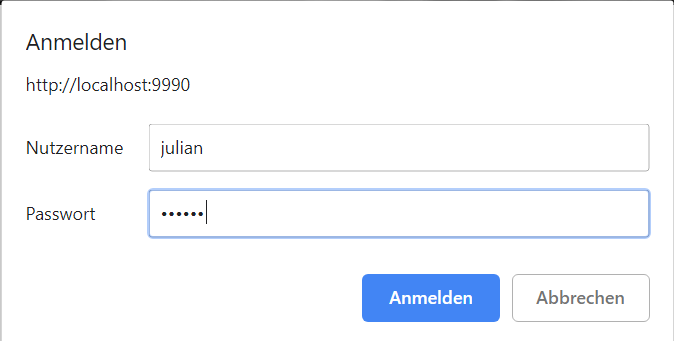
- DerbyDB downloaden
  - [Downloaden unter https://db.apache.org/derby/derby_downloads.html](https://db.apache.org/derby/derby_downloads.html)
- Registrieren des JDBC-Treibers
  - Deployments -> Upload Deployment
- Auswählen des JDBC-Treibers
  - Verzeichnis "lib" -> derbyclient.jar
- Datasource Konfigurieren
  - Configuration -> Datasources & Drivers -> Datasources -> Add Datasource

Der Wildfly Server ist nun vollständig konfiguriert. Jetzt fehlt nur noch im Jakarta EE Projekt auf "Edit Configuration" als Application Server den zip Ordner "Wildfly 15" auszuwählen.
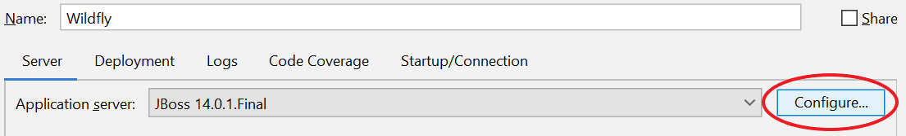
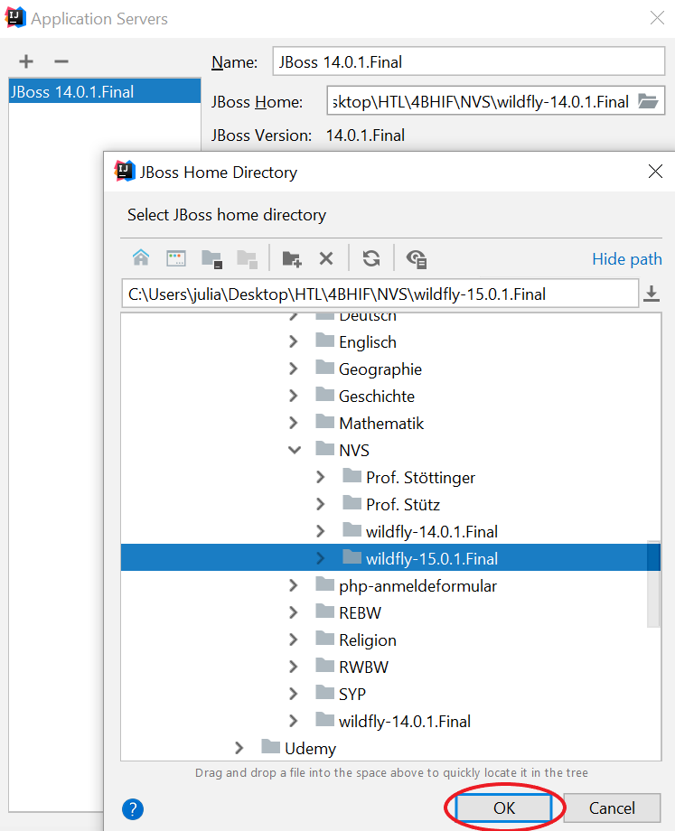

<b>Mögliche Fehlermeldung: </b>Es kann sein, dass der von Wildfly standardmäßig verwendete Port (8080) belegt ist und folgende Fehlermeldung erscheint "Error when JBoss starts: address already in use". 
<b>Bug Fix: </b> 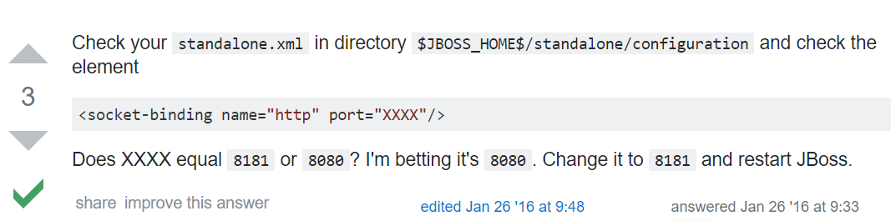 

Wildfly nun fertig konfiguriert! :tada

## Glassfish 5
#### Anforderungen
1. IntelliJ IDEA ULTIMATE Edition
2. JDK Version 1.8 oder höher
3. GlassFish application server Version 3.0.1 oder höher
4. Web Browser (logisch)

#### Konfiguration des GlassFish Servers
- Strg+Alt+S (oder IntelliJ IDEA -> Preferences auf macOS) Build,Execution, Deployment -> Application Servers -> Add -> Glassfish Server 
  - Heruntegeladenen GlassFish Server auswählen
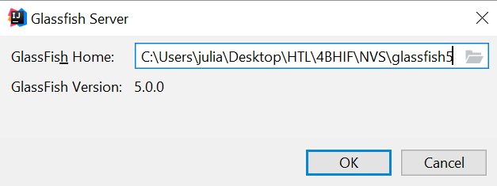

#### Konfiguration der JDK (nur falls noch nicht vorhanden)
- Strg+Shift+Alt+S (oder File -> Project Structure) im Hauptmenü
- "JDK" auswählen und eine Java Version >= 1.8 wählen

#### Projekt erstellen (ansonsten neue Configuration adden)
- JavaEnterprise anstelle von Maven nehmen
- Bei Application Server GlassFish 5.0.0 auswählen
- Web Application und RESTful Web Service anhaken
- Projektnamen vergeben und erstellen

#### Projektstruktur
- src Verzeichnis 2 Klassen erstellen (Endpoint und RestConfig)
  - Endpoint = "HelloCar.java"
  - RestConfig = "MyApplication.java"
  - KEIN persistence.xml vorhanden
-  Struktur
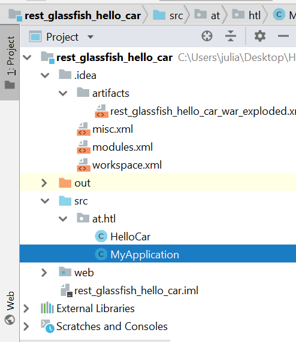
#### Source Code
- HelloCar.java (CarEndpoint) 
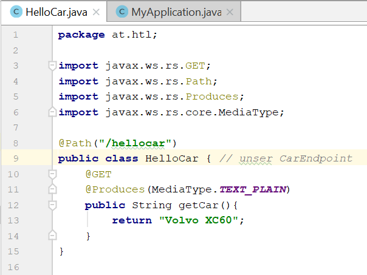 
- MyApplication.java (RestConfig)
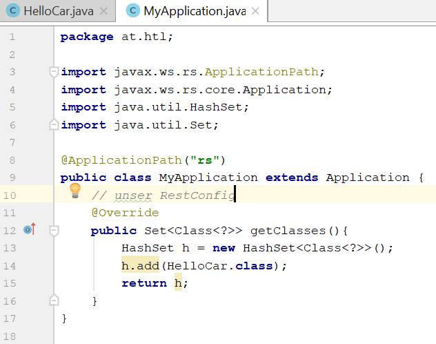

#### Artifact Konfiguration
- Strg+Shift+Alt+S (oder File -> Project Structure)
- Project Settings -> Artifacts
- einziges (defaultmäßig ausgewähltes) Artifakt ist das projektname:war exploded
- im Normalfall muss hier nichts verändert werden 

#### Run Configuration (Edit Configurations)
- On 'Update' action auf "Restart Server"
- Sonst bleibt alles gleich 
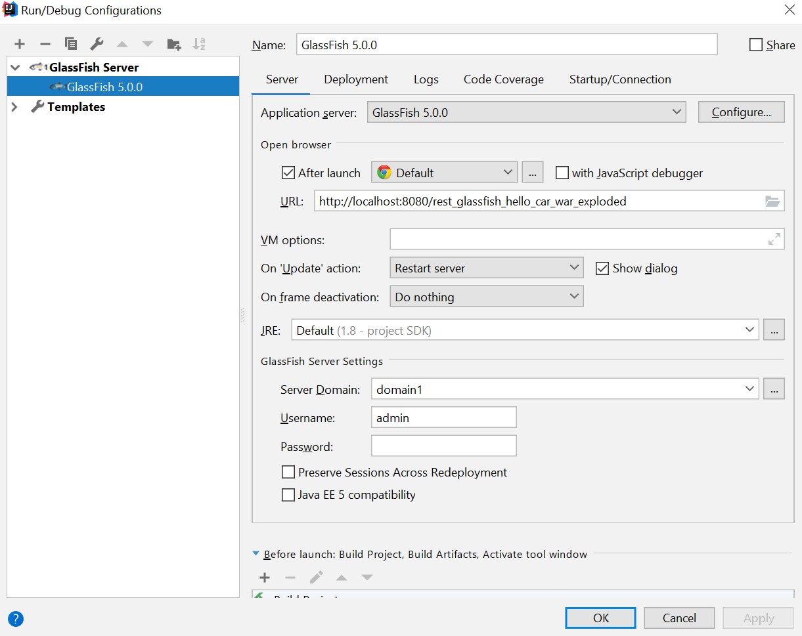

#### Server starten
- Ausgabe im Browser

GlassFish nun fertig konfiguriert! :tada:

#### Mögliche Schwierigkeiten
- Beim Starten: "address already in use"
  - Bug Fix:
  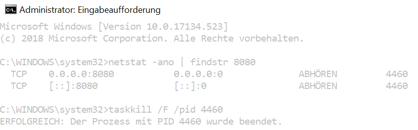

#### Einbinden in ein bestehendes Projekt
- bereitet Probleme beim Starten
  - Exception Message: java.io.IOException: com.sun.enterprise.admin.remote.RemoteFailureException
  - Diverse StackOverflow Lösungsansätze, dependency Erweiterungen im pom-File und im config Verzeichnis von glassfish den http-listener ändern hat leider nichts geholfen
- Ich habe es nicht geschafft, GlassFish in ein bestehendes Projekt einzubauen...

## Liberty 
#### Download
- [Downloaden unter https://developer.ibm.com/wasdev/downloads/download-latest-stable-websphere-liberty-runtime/](https://developer.ibm.com/wasdev/downloads/download-latest-stable-websphere-liberty-runtime/)

#### Zusätzliche Features installieren (inkl. full Java EE 8 support)
 - bin/installUtitlity install adminCenter-1.0
 - bin/server start
 - usr/servers/server-name/dropins
 - bin/installUtility install javaee-8.0
 
 #### Maven dependency
 - im pom-File des jeweiligen Projektes folgendes dependency hinzufügen 
 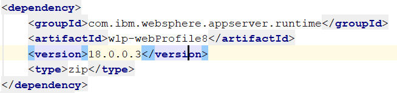
 
 #### Konfiguration
 - "Edit Configuration" und dann neuen Application Server (WebSphere Local) auswählen
 - Selbes Spiel wie bei allen anderen auch (siehe Wildfly)
 
 #### Starten des Servers
 - Beim Starten kommt folgende Fehlermeldung: "[ERROR   ] CWWKZ0002E: Beim Starten der Anwendung Tennisclubadministration_war_exploded ist eine Ausnahme eingetreten. Ausnahmenachricht: com.ibm.ws.container.service.state.StateChangeException: java.lang.IllegalStateException: CWOWB2000E: Die Annotation @javax.transaction.Transactional(value=REQUIRED, rollbackOn=[], dontRollbackOn=[]) ist in der EJB TennisplayerEndpoint nicht zulässig." 
Das heißt, dass ich die @Transactional Annotation weggeben muss - soweit so gut. 
Durch was soll ich es ersetzen? Keine Ahnung, deshalb habe ich es jetzt erstmal weggelassen.
- Dann erschien folgende Fehlermeldung: "[ERROR   ] CWWKZ0002E: Beim Starten der Anwendung Tennisclubadministration_war_exploded ist eine Ausnahme eingetreten. Ausnahmenachricht: com.ibm.ws.container.service.state.StateChangeException: com.ibm.ws.exception.RuntimeWarning: CNTR0201E: The InitBean startup singleton session bean in the tennisclubadministration module failed initialization." 
Fragen über Fragen, das Internet weiß leider keine für mich zufriedenstellende Antwort, deshalb hab ich es endgültig sein lassen.

Liberty funktioniert nicht!

## TomEE
#### Download
- [Downloaden unter http://tomee.apache.org/downloads.html](http://tomee.apache.org/downloads.html)
Die offizielle Website von Apache TomEE verweist darauf hin, dass die aktuellste Version "NOT JavaEE7 certified" ist.

#### Konfiguration
- Für Mac OSX:
  - [Tutorial unter macappstore.org/tomee-plus/](http://macappstore.org/tomee-plus)
- Für Windows:
  - cmd als Administrator ausführen und in das bin-Verzeichnis von apache-tomee-7... gehen
  - "service.bat install" ausführen 
- Neue Konfiguration (TomEE Local) angelegt, bei Application Server die heruntergeladene Version ausgewählt und den Port angegeben
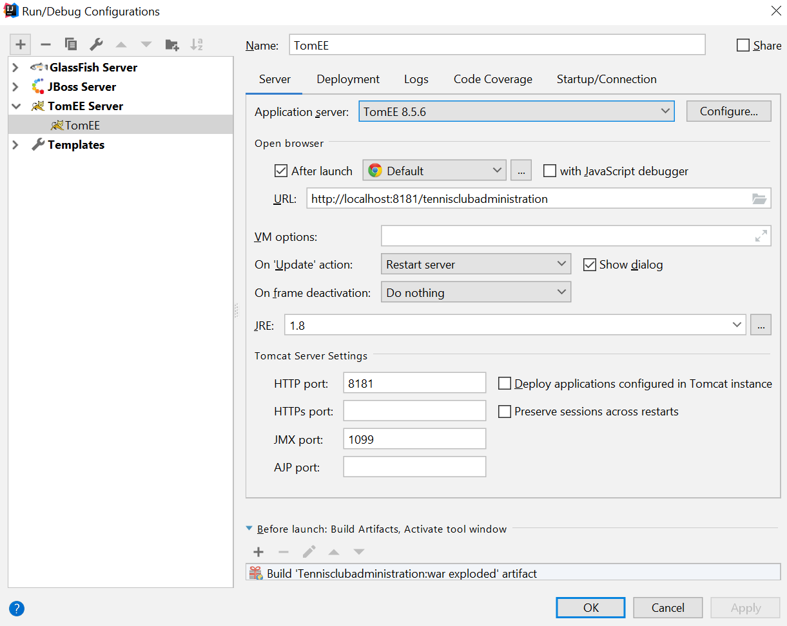
- funktioniert trotdem nicht - was fehlt noch??

#### Starten des Servers
- Nachdem die Connection zum Server erfolgreich verlaufen ist, kommt folgende <b>Fehlermeldung</b>
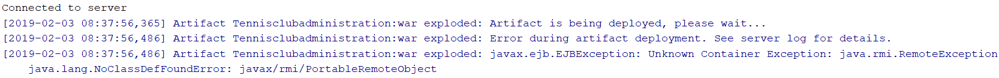
- Auch hier habe ich schon zahlreiche Lösungen ausprobiert, nichts hat jedoch funktioniert.

TomEE funktioniert nicht!

## Payara 5
Habe Klassenkameraden gefragt, keiner konnte den Payara 5 zum Laufen kriegen...
